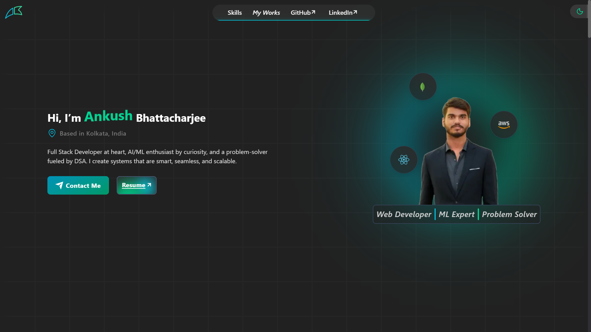
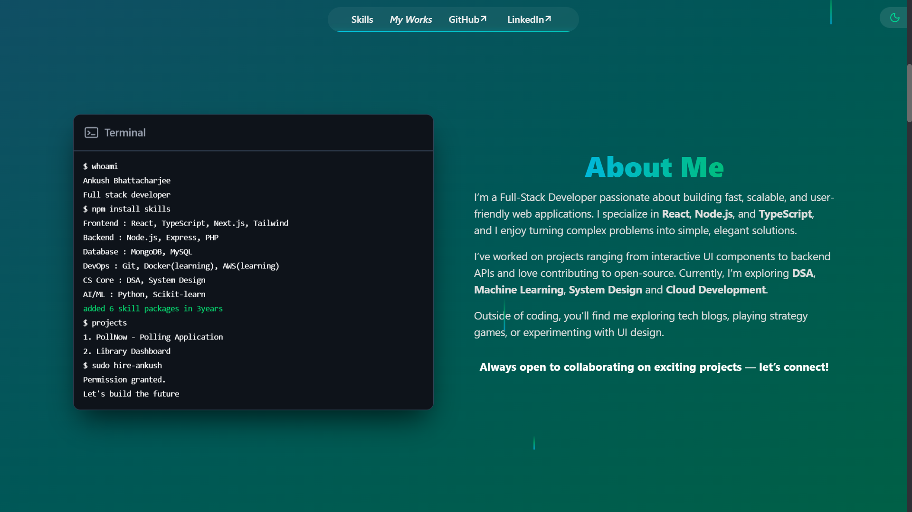

# Ankush Bhattacharjee's Portfolio

A modern, responsive developer portfolio crafted with Next.js, TypeScript, and Tailwind CSS, emphasizing performance, clean design, and seamless user interaction.



## Live Demo

- [https://ankush-bhattacharjee-portfolio.vercel.app](https://ankush-bhattacharjee-portfolio.vercel.app)

## Sections

- Hero
- About
- Skills
- Projects
- Contact

## Tech Stack

- Next.js 15 (App Router)
- React 19
- TypeScript
- Tailwind CSS 4
- Framer Motion
- Lenis (smooth scrolling)
- next-themes (dark/light mode)
- EmailJS (contact form)
- AceternityUI, MagicUI

## Features

- Responsive single-page portfolio layout
- Dedicated sections: Hero, About, Skills, Projects, Contact
- Dark and light theme toggle
- Smooth scrolling with reveal animations
- Project showcase cards with GitHub and live demo links
- Resume preview and download page
- Contact form integration using EmailJS
- Social and coding profile links in footer

## Run Locally

### Prerequisites

- Node.js 18.18+ (recommended)
- npm

### Setup

```bash
git clone https://github.com/ankush-github-11/portfolio.git
cd portfolio
npm install
```

### Start Development Server

```bash
npm run dev
```

Open [http://localhost:3000](http://localhost:3000) in your browser.

## Available Scripts

- `npm run dev` - Start development server
- `npm run build` - Create production build
- `npm run start` - Start production server
- `npm run lint` - Run ESLint

## Deployment

This project is deployed using Vercel with automatic CI/CD from the main branch.

Every push to the main branch triggers a production deployment.

## 📄 License

This project is open-source and available for learning and inspiration.

Feel free to fork and customize it for your own portfolio.
